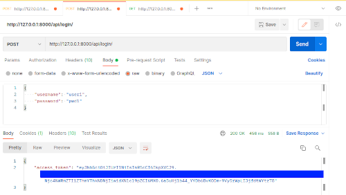

# Django REST API with JWT Authentication

## Overview

This project demonstrates how to build a secure RESTful API using Django and JSON Web Tokens (JWT) for authentication. It includes features like user registration, login, and protected API endpoints, ensuring that user data is kept secure and private. The JWT-based authentication system provides a stateless and scalable method for handling authentication.

---

## Project Structure
```bash
django-rest-jwt-api/
│── api/                   # Application with views and models for API
│── core/                  # Django settings and configuration
│── manage.py              # Django management script
│── requirements.txt       # Project dependencies
│── README.md              # Project documentation
```

## Directory Sizes

Below are the sizes of the key files and directories in the project after setting up the virtual environment, installing the required dependencies, and creating an empty SQLite database:

```bash
$ du -ah --max-depth=1 .

4,0K    ./LICENSE
4,0K    ./requirements.txt
4,0K    ./.gitignore
4,0K    ./manage.py
60K     ./screenshot_postman_register.png
160K	./db.sqlite3
36K 	./core
68K     ./screenshot_postman_login.png
72K	    ./screenshot_postman_accessing_a_protected_endpoint.png
64K	    ./screenshot_server_running.png
60K	    ./api
16K	    ./README.md
72K	    ./screenshot_postman_failed_to_access_protected_data.png
696K	./.git
72M     ./env39
73M	    .
```

This size reflects the basic structure, including the project files, virtual environment, and a freshly created database.

---

## Screenshots

### Server Running:


### Failed to Access Protected Data:


### User Register:


### User Login:




### Accessing a Protected Endpoint:


---

## Features
- **User Registration & Login**: Secure authentication system with hashed passwords.
- **JWT Authentication**: Uses JSON Web Tokens for authentication and session management.
- **Protected Endpoints**: Access to specific API routes is restricted to authenticated users.
- **Token Blacklisting**: Enables immediate revocation of tokens for enhanced security.
- **Error Handling**: Proper responses for invalid requests and authentication failures.

## How JWT Works in This Project
- **User Login**: The client sends a POST request with their credentials.
- **JWT Token Issued**: If credentials are valid, a JWT token is returned.
- **Accessing Protected Endpoints**: Users must include the token in the Authorization header to access protected routes.
- **Token Validation**: The server verifies the token before granting access.
- **Token Blacklisting (Optional)**: Enables immediate token revocation, useful for logout and security policies.

### Token Blacklisting (Optional)
By default, JWT tokens remain valid until they expire. However, using `rest_framework_simplejwt.token_blacklist`, you can:

- Invalidate tokens before expiration.

- Improve security by revoking access immediately after logout.

To enable blacklisting, ensure the following setting is added in `settings.py`:

```python
INSTALLED_APPS = [
    ...
    'rest_framework_simplejwt.token_blacklist',
]
```

#### Without `rest_framework_simplejwt.token_blacklist`
- JWT tokens are generated and validated by the server.
- Tokens remain valid until they expire, unless the secret key is changed or the user is removed.
- There is no built-in way to invalidate a token before its expiration.

#### With `rest_framework_simplejwt.token_blacklist`
- You can blacklist specific tokens, making them invalid before their expiration.
- This is useful for implementing features such as user logout, where you want to immediately invalidate a token.
- You need to configure the `SIMPLE_JWT` settings to use the blacklist.

## Prerequisites
- Python 3.x
- Django
- Django REST Framework
- `djangorestframework-simplejwt` (for JWT authentication)


### How to Use

1. **Clone the Repository**
Clone the repository to your local machine:

```bash
git clone https://github.com/Jonahida/django-rest-jwt-api.git
cd django-rest-jwt-api
```

2. **Create a Virtual Environment**
It's recommended to create a virtual environment to manage dependencies.


- On **Linux/MacOS**:

```bash
python3.9 -m venv env39
source env39/bin/activate
```

- On **Windows**:

```bash
python3.9 -m venv env39
env39\Scripts\activate
```

3. **Install Dependencies**

With the virtual environment activated, install the required libraries:

```bash
pip3 install -r requirements.txt
```

4. **Run Migrations**

To create the database and apply migrations, run:

```bash
python manage.py migrate
```

5. **Run the Django Server**

To start the Django development server, run the following command:

```bash
python manage.py runserver
```

The server will start and listen at `http://127.0.0.1:8000/`.

6. **Create a Superuser (Optional)**

If you want to access the Django admin panel:

```bash
python manage.py createsuperuser
```

Follow the prompts to create a superuser account.


# API Endpoints

## 1. Register a New User

- **Endpoint**: `POST /api/register/`

- **Request Body**:

```json
{
  "username": "user1",
  "password": "pwd1",
  "email": "user1@example.com"
}
```

- **Response**:

```json
{"message": "User created successfully"}
```

- **cURL Example**:

```bash
$ curl -X POST http://localhost:8000/api/register/ -H "Content-Type: application/json" -d '{
    "username": "user1",
    "password": "pwd1",
    "email": "user1@example.com"
}'
```

## 2. User Login
- **Endpoint**: `POST /api/login/`

- **Request Body**:

```json
{
  "username": "user1",
  "password": "pwd1"
}
```

- **Response**:

```json
{
  "access_token": "your_jwt_token"
}
```

- **cURL Example**:

```bash
curl -X POST http://localhost:8000/api/login/ -H "Content-Type: application/json" -d '{
    "username": "user1",
    "password": "pwd1"
}'
```

## 3. Access a Protected Route
- **Endpoint**: `GET /api/protected/`

- **Headers**:

```makefile
Authorization: Bearer <JWT_TOKEN>
```

- **Response**:

```json
{"message": "You have access to this secure endpoint!"}
```

- **cURL Example**:

```bash
curl -X GET http://localhost:8000/api/protected/ -H "Authorization: Bearer <your_jwt_token>"
```

## Code Overview

This document provides a detailed explanation of the Django REST API implementation, which includes user registration, authentication, and protected routes using JWT authentication.

---

## 1. `views.py` (Handling API Requests)

### **Imports**
```python
from rest_framework import status
from rest_framework.response import Response
from rest_framework.views import APIView
from django.contrib.auth.models import User
from rest_framework_simplejwt.tokens import RefreshToken
from rest_framework.permissions import AllowAny, IsAuthenticated
import logging
```

- `APIView`: Class-based views for handling HTTP methods.
- `Response`: Sends structured JSON responses.
- `User`: Django's built-in user model.
- `RefreshToken`: Generates JWT tokens.
- `AllowAny` / `IsAuthenticated`: Controls API access.
- `logging`: Logs authentication attempts.

---

#### User Registration (`RegisterUserView`)

```python
class RegisterUserView(APIView):
    permission_classes = [AllowAny]  # Allow anyone to access this endpoint

    def post(self, request):
        username = request.data.get('username')
        password = request.data.get('password')
        email = request.data.get('email')

        if not username or not password or not email:
            return Response({"error": "All fields are required"}, status=status.HTTP_400_BAD_REQUEST)

        # Check if user already exists
        if User.objects.filter(username=username).exists():
            return Response({"error": "Username already taken"}, status=status.HTTP_400_BAD_REQUEST)

        # Create a new user with the provided credentials
        user = User.objects.create_user(username=username, password=password, email=email)
        user.save()

        return Response({"message": "User created successfully"}, status=status.HTTP_201_CREATED)
```

**Explanation**

1. **Allows Public Access** (`AllowAny`).
2. **Validates User Input**.
3. **Checks for Existing User**.
4. **Creates and Saves User**.

---

#### User Login (`LoginUserView`)
```python
class LoginUserView(APIView):
    permission_classes = [AllowAny]

    def post(self, request):
        username = request.data.get('username')
        password = request.data.get('password')

        if not username or not password:
            return Response({"error": "Both username and password are required"}, status=status.HTTP_400_BAD_REQUEST)

        logger.info(f"Attempting login for {username}")

        user = User.objects.filter(username=username).first()
        if not user or not user.check_password(password):
            return Response({"error": "Invalid credentials"}, status=status.HTTP_400_BAD_REQUEST)

        # Create JWT token
        refresh = RefreshToken.for_user(user)
        access_token = str(refresh.access_token)

        return Response({"access_token": access_token}, status=status.HTTP_200_OK)
```
**Explanation**

1. **Validates Credentials**.
2. **Logs Login Attempts**.
3. **Verifies User Credentials**.
4. **Generates JWT Token**.

---

#### Protected API (`SecureApiView`)
```python
class SecureApiView(APIView):
    permission_classes = [IsAuthenticated]  # Requires authentication

    def get(self, request):
        return Response({"message": "You have access to this secure endpoint!"})
```

**Explanation**

1. **Requires Authentication** (`IsAuthenticated`).
2. **Returns a Secure Response**.

---

## 2. `urls.py` (Routing API Endpoints)
```python
from django.urls import path
from .views import RegisterUserView, LoginUserView, SecureApiView

urlpatterns = [
    path('register/', RegisterUserView.as_view(), name='register'),
    path('login/', LoginUserView.as_view(), name='login'),
    path('secure/', SecureApiView.as_view(), name='secure-api'),
]
```

**Explanation**

- `/register/` → User Registration.
- `/login/` → User Login.
- `/secure/` → Protected Route.

---

## 3. `settings.py` (Django & JWT Configuration)

#### Django REST Framework & JWT Authentication

```python
REST_FRAMEWORK = {
    'DEFAULT_AUTHENTICATION_CLASSES': (
        'rest_framework_simplejwt.authentication.JWTAuthentication',
    ),
    'DEFAULT_PERMISSION_CLASSES': (
        'rest_framework.permissions.IsAuthenticated',
    ),
}
```

- **JWT Authentication** Enabled.
- **Default Permission**: Requires authentication.

#### JWT Token Configuration
```python
from datetime import timedelta

SIMPLE_JWT = {
    'ACCESS_TOKEN_LIFETIME': timedelta(minutes=5),
    'REFRESH_TOKEN_LIFETIME': timedelta(days=1),
    'BLACKLIST_AFTER_ROTATION': True,
    'ALGORITHM': 'HS256',
    'SIGNING_KEY': SECRET_KEY,
    'AUTH_HEADER_TYPES': ('Bearer',),
}
```

- ***Access Token**: Expires in 5 minutes.
- **Refresh Token**: Expires in 1 day.
- **Token Blacklisting**: Enabled.
- **Header Type**: `Authorization: Bearer <TOKEN>`.

## 4. `serializers.py` (User Data Serializatio)
```python
from rest_framework import serializers
from django.contrib.auth.models import User

class UserSerializer(serializers.ModelSerializer):
    class Meta:
        model = User
        fields = ['id', 'username', 'email']
```

**Explanation**

1. **Serializes `User` Model** (Converts to JSON).
2. **Includes Fields**: `id`, `username`, `email`.

## 5. API Flow Summary

| Step | User Action          | API Endpoint | Authentication | Response               |
|------|----------------------|--------------|---------------|------------------------|
| 1    | Register            | `/register/` | Not required  | Creates user          |
| 2    | Login               | `/login/`    | Not required  | Returns JWT token     |
| 3    | Access Secure Data  | `/secure/`   | Required (JWT) | Returns protected data |


## 6. API Usage Example

#### Register a User

```bash
curl -X POST http://127.0.0.1:8000/register/ -H "Content-Type: application/json" -d '{
    "username": "testuser",
    "password": "securepassword",
    "email": "test@example.com"
}'
```

#### Login to Get JWT Token

```bash
curl -X POST http://127.0.0.1:8000/login/ -H "Content-Type: application/json" -d '{
    "username": "testuser",
    "password": "securepassword"
}'
```

#### Access Protected API with JWT

```bash
curl -X GET http://127.0.0.1:8000/secure/ -H "Authorization: Bearer <JWT_TOKEN>"
```

## 7. Conclusion
- **User Registration & Authentication with JWT**.
- **Secure API Access** via Bearer Token.
- **REST API using Django REST Framework**.

**Secure, Scalable, and Stateless Authentication!**


# Contributing

Contributions are welcome! To contribute to this project:

- Fork the repository.
- Create a new branch for your feature or bug fix.
- Submit a pull request or open an issue to discuss any enhancements or bug fixes.

# License

This project is licensed under the MIT License. See the LICENSE file for details.

